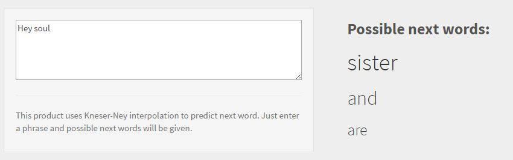
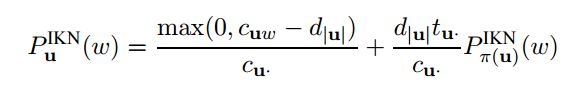
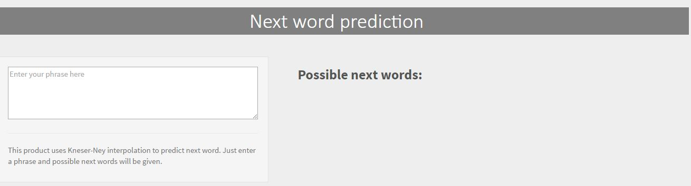

Next Word Prediction using ngram model
========================================================
author: Pravesh Koirala
date: 2016/01/21

Introduction
========================================================
 
This app (named, unsurprisingly, NextWord), outputs a probable next word
given the words preceding it. 
 
 
Inspired from apps like Swiftkey, NextWord uses a corpus to build upto 3-gram models to give predictions.

Algorithm
========================================================
<small>
<small>
NextWord uses Kneser-Ney interpolation which functions as both smoothing
and backoff model.
 
 
*[Kneser-Ney Interpolation](http://www.stats.ox.ac.uk/~teh/research/compling/hpylm.pdf) in a nutshell* 
 

$Where:$  

$P^{IKN}_{\pi(u)}(w)$ is the interpolated kneser-ney probability for word $w$ given context $u$  
$c_u$  is the count for the context u  
$c_{uw}$  is the count for the word w under context u  
$d_{|u|}$  is the discount value for context length u  
$t_u$  is the count for the context u  
$P^{IKN}_{\pi(u)}(w)$  is the backoff probability of word w under context u

</small>
</small>

Algorithm.. creating the model
========================================================
<small>
Cleaning: 

- change all text to lowercase
- remove profanities
- remove all numbers, punctuations except for apostrophes (')

The input is then tokenized and upto 3 grams model is created (using quanteda).

Only those trigrams or bigrams with their count > 1 are selected.

Any input I is cleaned in similar fashion as the corpus and then the Kneser-Ney Interpolation is used to give a prediction.

</small>

The APP *badum tiss*
=======================================================

<small>
The app is hosted [here](https://praveshkoirala.shinyapps.io/NextWord/)  

  
Simply type the phrase in the textbox and the app will give the top three predictions. (first prediction might be a bit slow)
</small>

Algorithm (II)
=======================================================
<small><small>
- In English, Kneser-Ney interpolation method works by the observation that
certain words are more likely given a certain context.  

- A classical example of this is the word "San Francisco". By itself, the unigram
"Francisco" is less likely to occur than the unigram "glasses". But under the context "San", it is much more likely than "glasses". (San glasses is simply unheard of).

- Kneser-Ney accomplishes this by using the counts of the word after the context instead of its absolute count.

- It also functions as smoothing model. It discounts a fixed value from the probability masses of higher order grams and assigns it to the lower order masses. In NextWord, the discount function used is $log(max(c_{uw}))$

</small></small>

